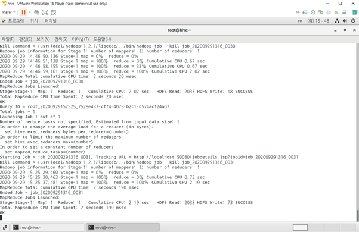
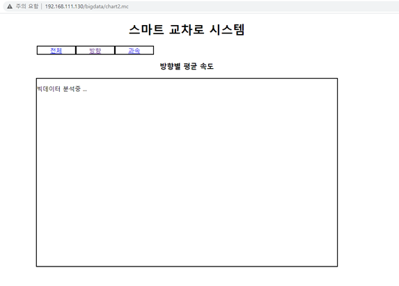
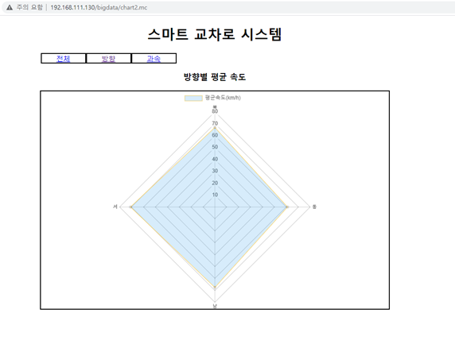

## 가상의 스마트 교차로 시스템

> 스마트 교차로에서 수집된 데이터가, 리눅스 서버에 저장되어진다. 저장된 데이터는 빅데이터 분석을 통해 의미 있는 데이터로 가공되어 지고, 웹에서 시각화 된 차트로 구현된다. 

* 수집된 데이터는 임의 생성된 데이터로 대체한다.
* 빅데이터 분석은 간단한 HIVEQL문으로 대체한다.

#### 시스템 구성도

#### 구현 기술

| 분야     | 기술                                                         |
| -------- | ------------------------------------------------------------ |
| 공통     | Java SE Development Kit 8u261, Eclipse IDE                   |
| 빅데이터 | Hadoop 1.2.1, Hive 1.0.1, MariaDB 10.0.15,                   |
| 웹       | HTML 5 , JavaScript, Chart.js, AJAX, JSP, Eclipse IDE, Maven, Spring, Json |

#### 구현 내용

- 리눅스에서 실행되고 있는 hive

  

* hive 분석중

  

* 분석 완료

  